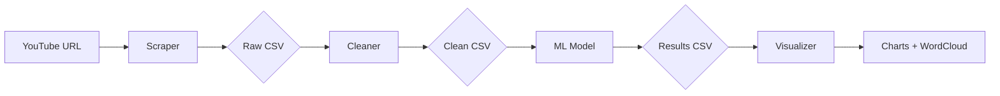

# 🎯 Social Media Listen Tool - YouTube Sentiment Analysis

<div align="center">


**Automated YouTube Comment Sentiment Analysis with Modern Visualization**

[Features](#-features) • [Installation](#-installation) • [Usage](#-usage) • [Architecture](#-architecture) • [Configuration](#%EF%B8%8F-configuration)

</div>

---

## 📋 Overview

Social Media Listen Tool is an **end-to-end automated pipeline** for analyzing YouTube comment sentiment in Vietnamese. Built with **sklearn MultinomialNB** and **modern data visualization**, it provides actionable insights into audience opinions.

### 🎯 What it does:

```
YouTube Video → Scrape Comments → Clean Data → AI Analysis → Beautiful Visualizations
```

---

## ✨ Features

### 🤖 **Fully Automated Pipeline**
- ✅ **Selenium-based scraper** with auto-scroll for lazy-loaded comments
- ✅ **Smart data cleaning** with Vietnamese text processing
- ✅ **Machine Learning** sentiment classification (85%+ accuracy)
- ✅ **Modern dark-theme visualizations** with word clouds & charts

### 🚀 **Production-Ready**
- ✅ **Centralized configuration** (`config.py`)
- ✅ **Utility functions** to eliminate code duplication
- ✅ **Proper logging** with INFO/ERROR/DEBUG levels
- ✅ **Error handling** at every pipeline stage
- ✅ **Auto file management** with timestamps

### 📊 **Professional Visualizations**
- ✅ **Gradient Word Cloud** - Top 150 Vietnamese keywords
- ✅ **Donut Chart** - Sentiment distribution (Positive/Neutral/Negative)
- ✅ **Statistics Panel** - Sample counts, vocabulary size

---

## 🛠 Technologies

| Component | Technology |
|-----------|-----------|
| **Web Scraping** | Selenium + WebDriver Manager |
| **Data Processing** | Pandas + NumPy |
| **NLP** | pyvi (Vietnamese tokenization) |
| **Machine Learning** | scikit-learn (MultinomialNB + CountVectorizer) |
| **Visualization** | Matplotlib + WordCloud |

---

## 📦 Installation

### Prerequisites
- **Python 3.9+**
- **Google Chrome** browser

### Steps

1. **Clone the repository**
```bash
git clone https://github.com/yourusername/SocialMediaListenTool.git
cd SocialMediaListenTool
```

2. **Install dependencies**
```bash
pip install -r requirements.txt
```

3. **Verify installation**
```bash
python -c "from modules.AIModel import SentimentClassifier; print('✅ Installation successful!')"
```

---

## 🚀 Usage

### Quick Start

```python
from main import SocialMediaListenTool

# Set YouTube URL
url = "https://www.youtube.com/watch?v=VIDEO_ID"

# Run complete pipeline
tool = SocialMediaListenTool(url)
tool.run()
```

### Command Line

```bash
# Edit URL in main.py, then run:
python main.py
```

### Output

```
📁 Project Structure After Run:
├── data/
│   ├── raw_comments_2026-01-14_17-08-48.csv      # Scraped data
│   └── clean_comments_2026-01-14_17-08-48.csv    # Cleaned data
├── result/
│   └── test_results_2026-01-14_17-08-48.csv      # Predictions
└── modules/
    └── model.pkl                                  # Trained model
```

---

## 🏗 Architecture

### Project Structure

```
SocialMediaListenTool/
├── main.py                       # Pipeline orchestrator
├── config.py                     # Centralized configuration
├── utils.py                      # Common utility functions
├── requirements.txt              # Dependencies
│
├── modules/                      # Core components
│   ├── YoutubeCommentScraper.py # Comment scraping
│   ├── Cleaner.py               # Data cleaning
│   ├── AIModel.py               # Sentiment classifier
│   └── model.pkl                # Trained ML model
│
├── reports/                      # Visualization
│   └── Visualize.py             # Chart generation
│
└── data/                         # Data storage
    ├── stopwords.txt            # Vietnamese stopwords
    ├── raw_comments_*.csv       # Raw scraped data
    └── clean_comments_*.csv     # Processed data
```

### Pipeline Flow



---

## ⚙️ Configuration

### `config.py` - Centralized Settings

```python
# Scraper settings
SCRAPER = {
    "headless": True,          # Run browser in background
    "scroll_time": 30,         # Number of scroll iterations
    "window_size": "1920,1080"
}

# Model settings
MODEL = {
    "alpha": 1.0,              # Laplace smoothing
}

# Visualization settings
VISUALIZATION = {
    "max_words": 150,          # Words in word cloud
    "figure_size": (20, 8),    # Chart dimensions
}
```

### Customization

**Change scraping duration:**
```python
tool.scrape_comments(scroll_time=50)  # More comments
```

**Change visualization words:**
```python
# In config.py
VISUALIZATION["max_words"] = 200
```

---

## 📊 Model Performance

| Metric | Value |
|--------|-------|
| **Algorithm** | Multinomial Naive Bayes |
| **Accuracy** | 85.31% |
| **Training Data** | 23,818 Vietnamese comments |
| **Vocabulary Size** | 10,054 unique tokens |
| **Classes** | 3 (Positive, Neutral, Negative) |

### Label Distribution (Training Data)

- **Positive (0)**: 82.6% (19,658 samples)
- **Neutral (1)**: 6.7% (1,604 samples)
- **Negative (2)**: 10.7% (2,556 samples)

---

## 🔧 Advanced Usage

### Train Custom Model

```python
from modules.AIModel import SentimentClassifier

model = SentimentClassifier()
model._train("path/to/your/training_data.csv")
```

**Training data format:**
```csv
text,label
"sản phẩm tốt",0
"dịch vụ tệ",2
```

### Standalone Components

```python
# Use scraper only
from modules.YoutubeCommentScraper import YoutubeCommentScraper

scraper = YoutubeCommentScraper()
scraper._get_url("https://youtube.com/watch?v=...")
scraper._scroll(30)
comments = scraper.extract_comments()
```

---

## 🐛 Troubleshooting

### Common Issues

**1. ChromeDriver not found**
```bash
# Install webdriver-manager
pip install webdriver-manager
```

**2. Model not loaded**
```bash
# Train model first
python modules/AIModel.py
```

**3. Encoding errors in visualization**
- Already fixed with ASCII-safe text
- Vietnamese characters handled by ViTokenizer

---

## 📈 Roadmap

- [ ] Support for multiple languages
- [ ] Real-time comment monitoring
- [ ] API endpoint deployment
- [ ] Interactive dashboard (Streamlit)
- [ ] Aspect-based sentiment analysis

---

## 🤝 Contributing

Contributions are welcome! Please follow these steps:

1. Fork the repository
2. Create a feature branch (`git checkout -b feature/AmazingFeature`)
3. Commit changes (`git commit -m 'Add AmazingFeature'`)
4. Push to branch (`git push origin feature/AmazingFeature`)
5. Open a Pull Request

---

## 📄 License

This project is licensed under the MIT License - see [LICENSE](LICENSE) file for details.

---

## 👥 Authors

- **Tống Phước Hoài Nam** - *Initial work* - [YourGitHub](https://github.com/tetsde)

---

## 🙏 Acknowledgments

- **pyvi** - Vietnamese tokenization
- **sklearn** - Machine learning framework
- **Selenium** - Web automation
- **matplotlib** - Data visualization

---

<div align="center">

**⭐ Star this repo if you find it helpful!**

Made with ❤️ in Vietnam 🇻🇳

</div>
